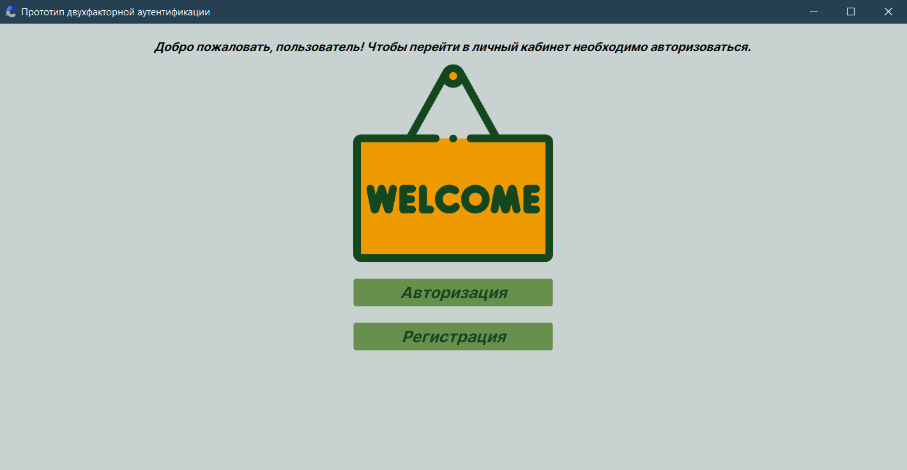
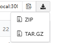

<h1 class="fig">Прототип двухфакторной аутентификации</h1>

## Описание

Данный проект реализовывает десктопное приложение предоставляет пользователям функционал авторизации и регистрации с возможностью управления своим профилем, включая загрузку и изменение фотографии.

# Технологии и инструменты разработки

Приложение было создано с использованием следующих технологий и инструментов:

- **Язык программирования**: C#
- **IDE**: Visual Studio
- **Framework**: Avalonia UI
- **UI-библиотека**: ReactiveUI
- **Архитектурный шаблон**: MVVM (Model-View-ViewModel)
- **ORM для работы с базой данных**: Entity Framework Core 
- **База данных**: PostgreSQL 
- **Язык разметки**: XAML 
- **Менеджер пакетов для .NET**: NuGet 

# Особенности проекта

### **Особенности**:
- Пользователь может менять своё фото профиля через кнопку "Изменить фото".
- При нажатии открывается диалоговое окно для выбора нового файла с компьютера. 
- При выборе нового фото происходит обновление данных в базе данных, после чего обновленное изображение отображается на экране.

Пример кода с методом реализацией добавления/изменения фото для профиля:

    public async Task AddOnePhoto()
    {
        if (Application.Current?.ApplicationLifetime is not IClassicDesktopStyleApplicationLifetime desctop || desctop.MainWindow?.StorageProvider is not { } provider) throw new NullReferenceException("провайдер отсутствует");

        var file = await provider.OpenFilePickerAsync(
            new FilePickerOpenOptions()
            {
                Title = "Выберите изображение",
                AllowMultiple = false,
                FileTypeFilter = [FilePickerFileTypes.All, FilePickerFileTypes.ImageAll]
            }
            );
        if (file != null)
        {
            await using var readStream = await file[0].OpenReadAsync();
            byte[] buffer = new byte[readStream.Length];
            readStream.ReadAtLeast(buffer, 1);
            NewUser.Image = buffer;

            MainWindowViewModel.myConnection.SaveChanges();
            string Messege = "Изображение успешно добавлено!";
            ButtonResult result = await MessageBoxManager.GetMessageBoxStandard("Сообщение с уведомлением!", Messege, ButtonEnum.Ok).ShowAsync();
        }
    }

# Начало работы

Чтобы начать работать с проектом, размещённым на Gogs, следуйте этим шагам и условиям:

## Необходимые условия

Перед запуском приложения убедитесь, что ваш локальный компьютер соответствует следующим требованиям:

1. Операционная система

   - Windows 10 или выше
   - macOS 10.14 (Mojave) или выше
   - Linux (с поддержкой необходимых библиотек)

2. Процессор

   - Минимум: 2 ядра
   - Рекомендуется: 4 ядра или больше для оптимальной работы

3. Оперативная память

   - Минимум: 4 ГБ
   - Рекомендуется: 8 ГБ или больше, особенно для ресурсовёмких приложений

4. Место на диске

   - Минимум: 1 ГБ свободного места для установки приложения и зависимостей
   - Рекомендуется: 5 ГБ и более для хранения всех необходимых компонентов и данных
5. Программа-архиватор для распоковки архиватора (на выбор)
    - WinRAR
    - 7-Zip
6. Доступ к интернету для загрузки информации из базы данных

## Установка

- **Откройте** один из браузеров: _Chrome_,_Opera_,_MicrosoftEdge_
- **Перейдите** на сайт по ссылке: http://gogs.ngknn.ru:3000/GoncharovaNE33P/RegAndAuth.git

- **Скачайте** архивный файл (ZIP):

- **Разархивируйте** скаченный файо, запустите приложение, найдя и открыв файл **RegAndAuth.exe** в папке **net8.0** в архиве bin по следующему пути: _RegAndAuth >  bin > Debug > net8.0_

## Авторы
- **Гончарова Надежда** - главный разработчик - [Профиль с другими проектами](http://gogs.ngknn.ru:3000/GoncharovaNE33P) 
